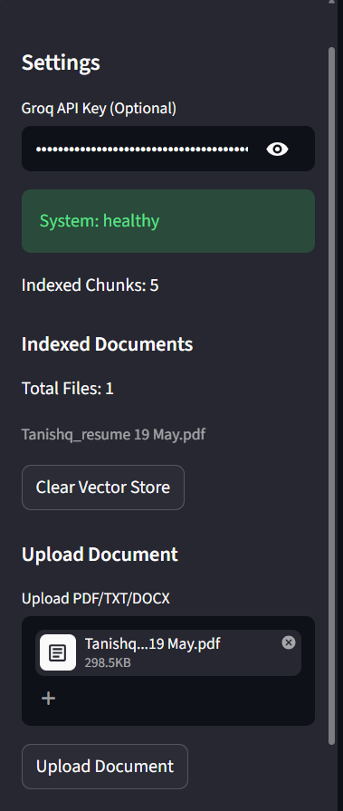
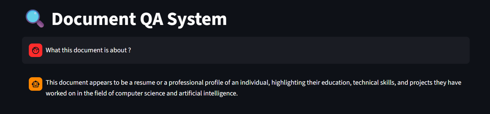
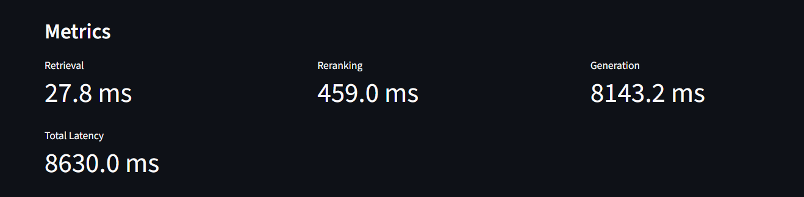
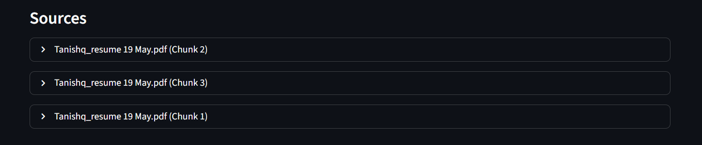

# 🔍 Document QA System

> Production-grade RAG pipeline for semantic document search, grounded question answering, and intelligent retrieval using FAISS, FastAPI, LangChain, and Groq-hosted LLMs.


---

# 📌 Overview

This project is a **Retrieval-Augmented Generation (RAG)** system that allows users to upload documents and ask natural language questions grounded strictly in document content.

The system combines:

- ⚡ Fast semantic retrieval using **FAISS**
- 🎯 Cross-encoder **re-ranking**
- 🧠 LLM answer generation using **Groq-hosted Llama 3.1**
- 📚 Grounded source citations
- 📊 Real-time latency metrics
- 💾 Persistent vector index caching
- 🐳 Dockerized deployment architecture
- 🚀 Deployed on HuggingFace Spaces

The application is designed with a modular backend architecture using **FastAPI**, while the frontend is built using **Streamlit** for an interactive user experience.

---

# 🔗 Live Links

- GitHub Repository: https://github.com/tanishq-2004/Document-QA-System
- Hugging Face Demo: https://huggingface.co/spaces/Skywalker67/Document-QA-System

---

# 🏗️ Architecture

```text
User Question
      │
      ▼
[Embedding Model]
sentence-transformers/all-MiniLM-L6-v2
      │
      ▼
[FAISS Vector Store]
Top-K semantic retrieval
      │
      ▼
[Cross-Encoder Re-ranking]
ms-marco-MiniLM-L-6-v2
      │
      ▼
[Groq-hosted LLM]
llama-3.1-8b-instant
      │
      ▼
Grounded Answer + Sources + Timing Metrics
```

---

# ✨ Features

- 📄 Upload and query PDF / DOCX / TXT documents
- ⚡ Sub-second semantic retrieval using FAISS
- 🎯 Two-stage retrieval with cross-encoder reranking
- 💾 Persistent vector index caching
- 📊 Live retrieval and generation latency metrics
- 🔍 Grounded source citations with chunk tracking
- 🧩 Modular FastAPI backend with REST APIs
- 🎛️ Interactive Streamlit frontend
- 🐳 Dockerized deployment
- ☁️ Deployable on Hugging Face Spaces

---

# 🛠️ Tech Stack

| Layer | Technology |
|---|---|
| Frontend | Streamlit |
| Backend | FastAPI + Uvicorn |
| Vector Database | FAISS |
| Embedding Model | sentence-transformers/all-MiniLM-L6-v2 |
| Re-ranker | ms-marco-MiniLM-L-6-v2 |
| LLM | llama-3.1-8b-instant (Groq API) |
| RAG Framework | LangChain |
| Document Parsing | PyPDF + python-docx |
| Containerization | Docker |
| Deployment | Hugging Face Spaces |

---

# 📂 Project Structure

```text
Document-QA-System/
│
├── app.py
├── streamlit.py
├── requirements.txt
├── Dockerfile
├── .dockerignore
├── README.md
│
├── uploaded_docs/
├── vector_store/
└── screenshots/
```

---

# 🚀 Run Locally

## 1. Clone Repository

```bash
git clone https://github.com/tanishq-2004/Document-QA-System.git

cd Document-QA-System
```

---

## 2. Create Virtual Environment

### Windows

```bash
python -m venv venv

venv\Scripts\activate
```

### Mac/Linux

```bash
python -m venv venv

source venv/bin/activate
```

---

## 3. Install Dependencies

```bash
pip install -r requirements.txt
```

---

## 4. Start FastAPI Backend

```bash
uvicorn app:app --reload --port 8000
```

---

## 5. Start Streamlit Frontend

```bash
streamlit run streamlit.py
```

---

## 6. Open Application

Frontend:

```text
http://localhost:8501
```

Backend Docs:

```text
http://localhost:8000/docs
```

---

# 🐳 Run with Docker

## Build Docker Image

```bash
docker build -t document-qa .
```

---

## Run Docker Container

```bash
docker run -p 8501:8501 -p 8000:8000 document-qa
```

---

# 🌐 API Endpoints

| Method | Endpoint | Description |
|---|---|---|
| GET | `/api/health` | System health and vector index statistics |
| POST | `/api/upload` | Upload and index documents |
| POST | `/api/query` | Ask questions against indexed documents |
| GET | `/api/documents` | View indexed documents and chunk counts |
| DELETE | `/api/reset` | Clear uploaded files and vector store |

---

# 📊 Performance

| Metric | Value |
|---|---|
| Semantic Retrieval | < 100ms |
| Cross-Encoder Reranking | ~100–300ms |
| End-to-End Query | ~1–2s |
| Indexed Documents | 20+ |
| Chunking Strategy | 500 chars / 50 overlap |
| Vector Persistence | Enabled |

---

# 🔍 Retrieval Pipeline

The retrieval pipeline follows a **two-stage architecture** for balancing retrieval speed and answer relevance.

---

## Stage 1 — Semantic Retrieval

- Documents are chunked using overlapping text splitting
- Chunks are embedded using:
  - `all-MiniLM-L6-v2`
- Embeddings are indexed in a FAISS vector database
- Top semantic candidates are retrieved efficiently

---

## Stage 2 — Cross-Encoder Re-ranking

Retrieved chunks are re-ranked using:

```text
ms-marco-MiniLM-L-6-v2
```

This improves:

- retrieval precision
- contextual relevance
- grounded response quality

---

## Final Generation

Top-ranked chunks are passed into:

```text
llama-3.1-8b-instant
```

hosted through the Groq API for fast low-latency inference.

The model generates answers strictly grounded in retrieved context.

---

# 📸 Screenshots

## Upload Interface



---

## Answer Generation



---

## Metrics Dashboard



---

## Source Citations



---

# ☁️ Deployment

This project is fully deployable on:

- Hugging Face Spaces
- Render
- Railway
- Docker-compatible cloud platforms

Recommended deployment:
- Hugging Face Spaces (Docker SDK)

---

# 🚀 Deploy on Hugging Face Spaces

## 1. Create a New Space

Go to:

```text
https://huggingface.co/new-space
```

Choose:

- SDK → Docker
- Visibility → Public
- Hardware → CPU Basic

---

## 2. Add Space Remote

```bash
git remote add space https://huggingface.co/spaces/Skywalker67/Document-QA-System
```

---

## 3. Push Code

```bash
git add .

git commit -m "Deploy RAG system"

git push space main
```

---

# 📄 Resume Highlights

This project demonstrates:

- Production-style RAG architecture
- Semantic retrieval engineering
- Cross-encoder reranking
- FastAPI backend engineering
- Vector database optimization
- Grounded LLM response generation
- Docker-based deployment workflows
- Retrieval latency optimization

---

# 👨‍💻 Author

## Tanishq Gupta

Final-year B.Tech student focused on:

- Generative AI
- Retrieval-Augmented Generation (RAG)
- Semantic Search Systems
- AI-powered Backend Engineering

---

# 📜 License

MIT License

Free to use, modify, and distribute.